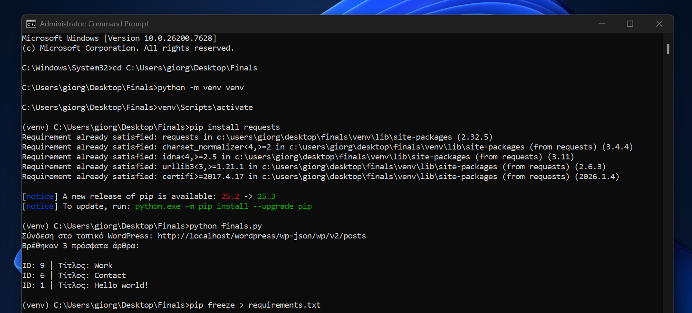
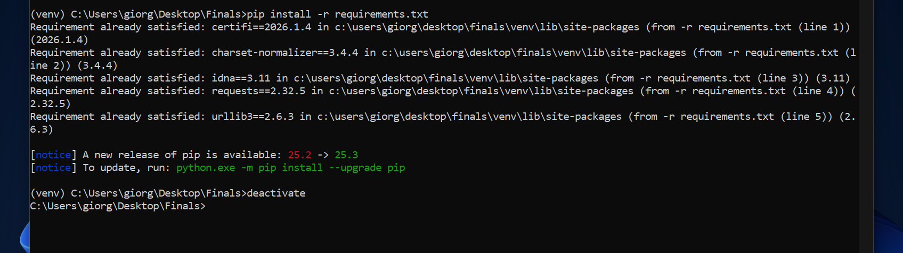

# WordPress CLI Manager Tool


---

## Περιεχόμενα
- [Εισαγωγή & Σενάριο](#1-εισαγωγή--σενάριο)
- [Θεωρητικό Υπόβαθρο & Ανοικτότητα](#2-θεωρητικό-υπόβαθρο--ανοικτότητα-μέρος-α)
  - [Αδειοδότηση](#21-αδειοδότηση-licensing)
  - [Επιχειρηματικό Μοντέλο](#22-επιχειρηματικό-μοντέλο-managed-support)
  - [Διαφάνεια](#23-διαφάνεια)
- [Διαχείριση Περιβάλλοντος](#3-διαχείριση-περιβάλλοντος-μέρος-γ)
- [Δομή Project & .gitignore](#4-δομή-project--gitignore-μέρος-δ)
- [Μελλοντικές Βελτιώσεις](#5-μελλοντικές-βελτιώσεις-github-issues)
- [Screenshots](#6-screenshots)
- [Contributing](#contributing)
- [Contact](#contact)

---

## 1. Εισαγωγή & Σενάριο
Το παρόν εργαλείο αναπτύχθηκε στο πλαίσιο της εργασίας για τον ρόλο του **Τεχνικού Ανοιχτού Λογισμικού**.  
Πρόκειται για ένα CLI (Command Line Interface) εργαλείο σε Python που αυτοματοποιεί την επικοινωνία με ένα τοπικό WordPress site (μέσω XAMPP) χρησιμοποιώντας το REST API.

---

## 2. Θεωρητικό Υπόβαθρο & Ανοικτότητα (Μέρος Α)

### 2.1 Αδειοδότηση (Licensing)
Επιλέχθηκε η άδεια **[GPLv3](LICENSE)** για διασφάλιση της ελευθερίας του κώδικα (copyleft), προστατεύοντας την ανοικτότητα της λύσης.

### 2.2 Επιχειρηματικό Μοντέλο (Managed Support)
Με βάση αυτό το εργαλείο, προτείνεται η παροχή υπηρεσιών **Managed Support** σε τρίτους:
- **Αυτοματοποιημένο Monitoring:** Χρήση του script για τον έλεγχο της κατάστασης του WordPress site του πελάτη.
- **Προληπτική Συντήρηση:** Παρακολούθηση των τελευταίων αναρτήσεων και διασφάλιση της ορθής λειτουργίας του API.
- **Υποστήριξη:** Παροχή εξειδικευμένων τεχνικών υπηρεσιών με μηνιαία συνδρομή.

### 2.3 Διαφάνεια
Η δημοσιοποίηση του κώδικα στο GitHub ενισχύει την αξιοπιστία του εργαλείου, επιτρέποντας δημόσιο έλεγχο, συνεργατική ανάπτυξη και διασφάλιση της τεχνικής αρτιότητας.

---

## 3. Διαχείριση Περιβάλλοντος (Μέρος Γ)
Για τη σωστή λειτουργία του εργαλείου:

1. **Δημιουργία εικονικού περιβάλλοντος:**
   ```cmd
   python -m venv venv
2. **Ενεργοποίηση περιβάλλοντος:**
   ```cmd
   venv\Scripts\activate
3. **Εγκατάσταση βιβλιοθήκης:**
   ```cmd
   pip install requests
4. **Δημιουργία αρχείου εξαρτήσεων:**
   ```cmd
   pip freeze > requirements.txt

---

## 4. Δομή Project & .gitignore (Μέρος Δ)
Το αποθετήριο ακολουθεί την εξής δομή:
* `finals.py`: Ο κύριος κώδικας του εργαλείου.
* `.gitignore`: Περιλαμβάνει τον φάκελο `venv/` και προσωρινά αρχεία για τη διατήρηση της καθαρότητας και ασφάλειας του αποθετηρίου.
* `requirements.txt`: Οι απαραίτητες βιβλιοθήκες Python.

---

## 5. Μελλοντικές Βελτιώσεις (GitHub Issues)
Έχει δημιουργηθεί Issue στο GitHub για την προσθήκη δυνατότητας διαγραφής άρθρου.

## 6. Screenshots
**Screenshot1**


---

**Screenshot2**


## Contributing

Contributions are welcome! Suggested workflow:

1. Fork the repository.
2. Create a branch for your feature/fix:
```bash
git checkout -b feature/YourFeature
```
3. Make changes and commit with a descriptive message:
```bash
git commit -m "Add feature description"
```
4. Push your branch:
```bash
git push origin feature/YourFeature
```
5. Open a Pull Request describing your changes.

Please ensure accessibility and code clarity when contributing.

---

## Contact

Giorgos Fyl  
Email: giorgosinbond@gmail.com  
GitHub: https://github.com/giorg1s
